# MVP Deployment Strategy for Banking System

## 🎯 **What is MVP (Minimum Viable Product)?**

**MVP** is the simplest version of your product that delivers core value to users while allowing you to learn and iterate quickly. For our banking system, it means deploying with essential features first, then gradually adding complexity.

## 🏗️ **MVP vs Full Production Deployment**

### **MVP Deployment Characteristics:**
- **Speed over Perfection**: Get to market quickly to validate assumptions
- **Core Features Only**: Focus on must-have functionality
- **Simpler Architecture**: Avoid over-engineering initially
- **Faster Feedback Loop**: Quick iterations based on user feedback
- **Lower Infrastructure Costs**: Start small, scale when proven
- **Risk Mitigation**: Test market fit before heavy investment

### **Full Production Deployment:**
- **Enterprise-grade Architecture**: Microservices, complex scaling
- **Complete Feature Set**: All planned functionality
- **High Availability**: 99.99% uptime requirements
- **Advanced Security**: Full compliance and audit trails
- **Global Scale**: Multi-region, millions of users

## 📊 **Banking System: MVP vs Full Feature Comparison**

| Aspect | MVP Deployment | Full Production |
|--------|----------------|-----------------|
| **Architecture** | Modular Monolith | Microservices |
| **Database** | Single PostgreSQL | Master-Slave + Sharding |
| **Caching** | Simple Redis | Multi-tier caching |
| **Authentication** | Basic JWT | OAuth2 + SSO + MFA |
| **Deployment** | Single server | Kubernetes cluster |
| **Monitoring** | Basic logging | Full observability stack |
| **Features** | Core banking only | Full feature suite |

## 🚀 **MVP Deployment Strategy for Banking System**

### **Phase 1: Core MVP (Weeks 1-4)**

#### **Essential Features Only:**
```java
// MVP Feature Set
✅ User Registration & Login
✅ Create Savings/Checking Accounts  
✅ Deposit Money
✅ Withdraw Money (with basic limits)
✅ Check Account Balance
✅ Simple Transaction History
✅ Basic Security (JWT tokens)

❌ Advanced Features (Later Phases):
❌ Loan Processing
❌ Credit Cards
❌ Investment Accounts
❌ Mobile Banking
❌ Third-party Integrations
❌ Advanced Fraud Detection
❌ Compliance Reporting
```

#### **Simplified Architecture:**
```yaml
# MVP Deployment - docker-compose.yml
version: '3.8'
services:
  banking-app:
    image: banking-system:mvp-1.0
    ports:
      - "8080:8080"
    environment:
      - SPRING_PROFILES_ACTIVE=mvp
      - DB_HOST=postgres
    depends_on:
      - postgres
      - redis

  postgres:
    image: postgres:13-alpine
    environment:
      POSTGRES_DB: banking_mvp
      POSTGRES_USER: banking_user
      POSTGRES_PASSWORD: ${DB_PASSWORD}
    volumes:
      - postgres_data:/var/lib/postgresql/data

  redis:
    image: redis:6-alpine
    volumes:
      - redis_data:/data

volumes:
  postgres_data:
  redis_data:
```

#### **MVP Configuration:**
```yaml
# application-mvp.yml
spring:
  application:
    name: banking-system-mvp
  
  datasource:
    url: jdbc:postgresql://postgres:5432/banking_mvp
    username: banking_user
    password: ${DB_PASSWORD}
    
  jpa:
    hibernate:
      ddl-auto: update  # Simpler for MVP
    show-sql: true     # Debug friendly
    
  redis:
    host: redis
    port: 6379
    
banking:
  features:
    loan-processing: false
    credit-cards: false
    mobile-banking: false
    advanced-fraud-detection: false
  
  limits:
    daily-withdrawal: 1000.00  # Conservative limits
    daily-transfer: 5000.00
    max-accounts-per-customer: 3
    
  security:
    jwt:
      expiration: 3600000  # 1 hour (shorter for MVP)
```

### **Phase 2: Enhanced MVP (Weeks 5-8)**

#### **Add Essential Improvements:**
```java
// Enhanced MVP Features
✅ Email Notifications
✅ Account Statements
✅ Simple Admin Panel
✅ Basic Fraud Alerts
✅ Customer Support Interface
✅ Mobile-responsive Web UI
```

#### **Infrastructure Improvements:**
```yaml
# Enhanced MVP with Load Balancer
version: '3.8'
services:
  load-balancer:
    image: nginx:alpine
    ports:
      - "80:80"
      - "443:443"
    volumes:
      - ./nginx.conf:/etc/nginx/nginx.conf
    depends_on:
      - banking-app-1
      - banking-app-2

  banking-app-1:
    image: banking-system:mvp-2.0
    environment:
      - SPRING_PROFILES_ACTIVE=mvp-enhanced
    depends_on:
      - postgres-master
      - redis

  banking-app-2:
    image: banking-system:mvp-2.0
    environment:
      - SPRING_PROFILES_ACTIVE=mvp-enhanced
    depends_on:
      - postgres-master
      - redis

  postgres-master:
    image: postgres:13-alpine
    environment:
      POSTGRES_DB: banking_mvp
    volumes:
      - postgres_master_data:/var/lib/postgresql/data
```

## 💰 **Cost Comparison: MVP vs Full Production**

### **MVP Deployment Costs (Monthly):**
```
Infrastructure:
- Single Application Server (t3.medium): $35
- Database (db.t3.micro): $15
- Load Balancer (ALB): $20
- Redis Cache (t3.micro): $12
- SSL Certificate: $0 (Let's Encrypt)
- Monitoring (Basic): $10
TOTAL: ~$92/month
```

### **Full Production Costs (Monthly):**
```
Infrastructure:
- Application Servers (3x t3.large): $180
- Database Cluster (2x db.r5.large): $350
- Redis Cluster (3x cache.r5.large): $180
- Load Balancers (2x ALB): $40
- CDN (CloudFront): $50
- Monitoring & Logging: $100
- Backup & DR: $75
TOTAL: ~$975/month
```

## 🎯 **MVP Deployment Strategy Benefits**

### **1. Faster Time to Market**
```java
// MVP: Simple account creation
@PostMapping("/accounts")
public ResponseEntity<AccountResponse> createAccount(@RequestBody CreateAccountRequest request) {
    // Basic validation only
    // Simple account creation
    // No complex business rules yet
    return ResponseEntity.ok(accountService.createAccount(request));
}

// Full Production: Complex account creation
@PostMapping("/accounts")
public ResponseEntity<ApiResponse<AccountResponse>> createAccount(
        @Valid @RequestBody CreateAccountRequest request,
        @AuthenticationPrincipal UserPrincipal user) {
    // Advanced validation
    // Credit checks
    // Compliance verification
    // Risk assessment
    // Document verification
    // Multiple approval workflows
    return ResponseEntity.ok(complexAccountService.createAccountWithFullValidation(request, user));
}
```

### **2. Quick Learning & Iteration**
```java
// MVP: Simple feedback collection
@GetMapping("/feedback")
public String getFeedback(Model model) {
    // Basic feedback form
    // Simple metrics collection
    return "feedback";
}

// Later: Advanced analytics
@GetMapping("/analytics/dashboard")
public ResponseEntity<AnalyticsDashboard> getAnalytics() {
    // Complex user behavior analysis
    // A/B testing results
    // Business intelligence insights
    // Predictive analytics
}
```

### **3. Risk Mitigation**
- **Market Validation**: Prove demand before heavy investment
- **Technical Validation**: Test architecture with real users
- **Regulatory Validation**: Start with basic compliance, enhance gradually
- **Team Learning**: Build expertise incrementally

## 📈 **MVP Evolution Path**

### **MVP → Enhanced MVP → Pre-Production → Production**

```mermaid
graph LR
    A[MVP v1.0<br/>Core Features] --> B[MVP v2.0<br/>Enhanced Features]
    B --> C[Pre-Production v3.0<br/>Advanced Features]
    C --> D[Production v4.0<br/>Enterprise Grade]
    
    A1[Single Server<br/>Basic Security] --> B1[Load Balanced<br/>Enhanced Security]
    B1 --> C1[Clustered<br/>Full Monitoring]
    C1 --> D1[Multi-Region<br/>99.99% Uptime]
```



## 🔧 **MVP Deployment Best Practices**

### **1. Feature Flags for Gradual Rollout**
```java
@Component
public class FeatureFlags {
    
    @Value("${banking.features.loan-processing:false}")
    private boolean loanProcessingEnabled;
    
    @Value("${banking.features.mobile-banking:false}")
    private boolean mobileBankingEnabled;
    
    public boolean isLoanProcessingEnabled() {
        return loanProcessingEnabled;
    }
}
```

### **2. Database Migrations for Evolution**
```sql
-- V1__MVP_Initial_Schema.sql
CREATE TABLE customers (
    id UUID PRIMARY KEY,
    first_name VARCHAR(100) NOT NULL,
    last_name VARCHAR(100) NOT NULL,
    email VARCHAR(255) UNIQUE NOT NULL,
    created_date TIMESTAMP DEFAULT NOW()
);

-- V2__MVP_Enhanced_Customer_Data.sql
ALTER TABLE customers ADD COLUMN phone_number VARCHAR(20);
ALTER TABLE customers ADD COLUMN address_street VARCHAR(255);
ALTER TABLE customers ADD COLUMN credit_score INTEGER;
```

### **3. Environment-Specific Configuration**
```yaml
# application-mvp.yml (Simple, fast development)
spring:
  jpa:
    hibernate:
      ddl-auto: update
    show-sql: true
  
logging:
  level:
    com.bankingsystem: DEBUG

# application-prod.yml (Production-ready)
spring:
  jpa:
    hibernate:
      ddl-auto: validate
    show-sql: false
    
logging:
  level:
    com.bankingsystem: INFO
```

## 🎯 **When to Evolve Beyond MVP**

### **Success Metrics for MVP Graduation:**
1. **User Adoption**: 1,000+ active users
2. **Transaction Volume**: $100,000+ processed monthly  
3. **System Stability**: 99.5% uptime for 30 days
4. **Feature Usage**: Core features used by 80% of users
5. **Business Validation**: Positive unit economics
6. **Technical Validation**: No major architecture blockers

### **Evolution Triggers:**
- **Performance Bottlenecks**: Single server can't handle load
- **Security Requirements**: Need for advanced compliance
- **Feature Complexity**: MVP architecture limiting new features
- **Team Growth**: Multiple teams need independent deployment
- **Market Expansion**: Need for multi-region support

## 💡 **Key MVP Deployment Lessons**

### **Do's:**
✅ **Start Simple**: Use proven technologies
✅ **Focus on Core Value**: What users absolutely need
✅ **Measure Everything**: Data-driven decisions
✅ **Plan for Evolution**: Avoid architectural dead ends
✅ **Security Baseline**: Even MVP needs basic security

### **Don'ts:**
❌ **Over-Engineer**: Resist building for imaginary scale
❌ **Feature Creep**: Stick to essential features only
❌ **Premature Optimization**: Profile before optimizing
❌ **Skip Testing**: Even MVP needs quality assurance
❌ **Ignore Feedback**: Users guide the evolution path

## 🚀 **Summary: Why MVP Deployment Matters**

For a banking system, MVP deployment allows you to:

1. **Validate Business Model**: Prove market demand before full investment
2. **Test Technical Architecture**: Identify scaling bottlenecks early
3. **Build User Base**: Start growing your customer community
4. **Iterate Quickly**: Rapid feature development and deployment
5. **Manage Risk**: Lower financial and technical risk
6. **Learn Fast**: Real user feedback drives product decisions

The key is balancing **speed to market** with **quality and security requirements** - especially critical in financial services where trust is paramount.

Remember: **MVP doesn't mean broken or insecure - it means focused on core value with room to grow!**